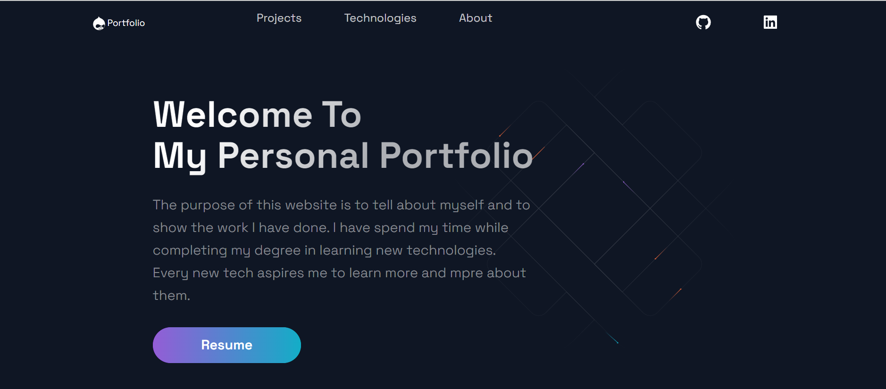
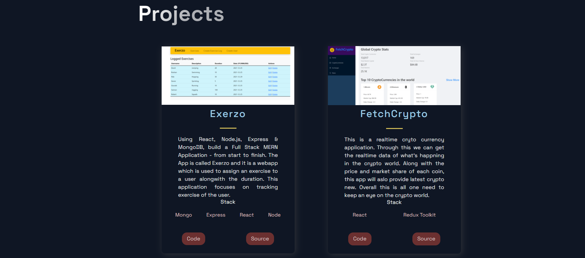
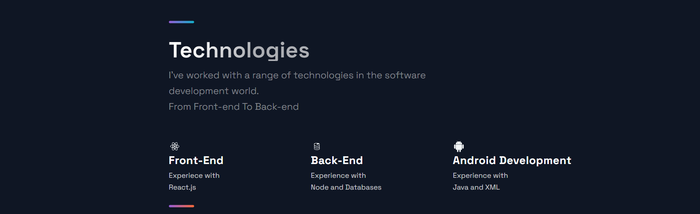
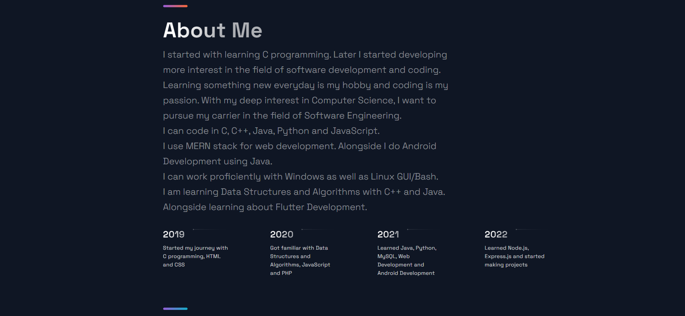

# Web Portfolio

Live Site: https://gourabchoudhuri.netlify.app
  

## About this project

This project is build to demonstrate my skills in a single page.\
In this page I have mentioned all my `projects` along with the `technologies` I have learned and worked with. 

In the `About` section I have shared my journey of learning programming along with the time stamps. 

This project is build using `React.js` along with `Next.js` and to make the UI look better I have used `styled-components` and `styled-normalize`. 

